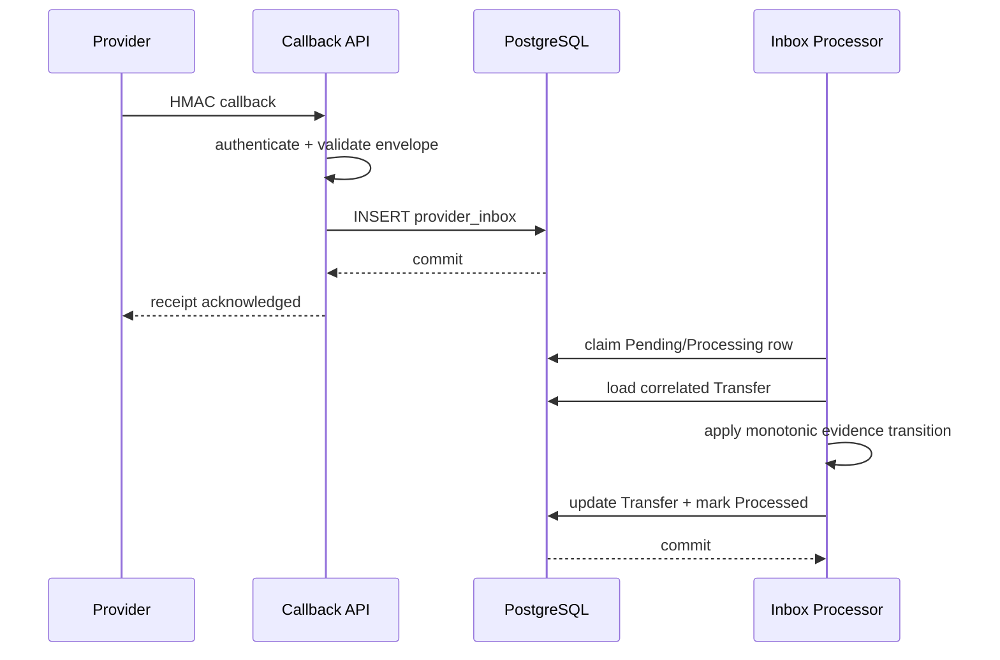

# Durable provider callback inbox

FaultLedger treats provider callbacks as at-least-once input. A callback may be duplicated, concurrent, delayed, replayed, or out of order; event IDs are delivery identities, not ordering guarantees.

The callback endpoint authenticates the raw synthetic JSON body with the configured `FaultLedger:Callbacks:Secret` HMAC-SHA256 secret and performs bounded envelope validation. It then stores a bounded normalized JSON representation in PostgreSQL `provider_inbox` and acknowledges only after that insert commits. The endpoint does not submit, reconcile, or infer a transfer from amount or display data. The application service exposes one explicit processing operation for deterministic invocation; a later worker can invoke the same service without changing the transaction boundary.

The `uq_provider_inbox_provider_event_id` constraint handles duplicate receipt. A duplicate event is acknowledged as already received. Event deduplication is separate from business-state idempotency: different event IDs carrying the same final state are retained, while the transfer state machine returns `AlreadyApplied` or `Stale` without another effect.

Processing claims one pending or previously processing row with PostgreSQL `FOR UPDATE SKIP LOCKED`. The transfer update and inbox `Processed` marker commit in one transaction. A crash before commit leaves the row recoverable; a crash after commit finds the row terminal and does not reapply the effect. Poison events (unknown correlation, incompatible provider reference, or illegal transition) are retained with `Failed` status and diagnostic text rather than retried forever.

Callbacks correlate only through the durable TransferId/provider-operation correlation. `ACCEPTED` can resolve `Submitting` or `Unknown`; `COMPLETED` can advance `Submitting` through accepted to completed, or resolve `Unknown` directly; explicit rejection/failure can resolve `Submitting` or `Unknown` to `Failed`. Late evidence cannot regress `Completed`, and callback processing never calls `SubmitAsync`.



Out-of-order delivery is handled by state monotonicity rather than timestamps:

```text
COMPLETED arrives -> Completed
later ACCEPTED arrives -> event retained, state remains Completed
```

`Unknown` may therefore resolve from a valid callback without reposting. Reconciliation and callbacks use the same explicit domain transitions and optimistic durable state; a callback can complete a transfer already reconciled to `Accepted`, while a late `Accepted` callback cannot overwrite a reconciled `Completed` state. When completion is applied, the callback transaction also creates the `TransferCompleted` outbox row atomically; the dispatcher publishes it at least once outside the database transaction. No external broker or exactly-once distributed delivery guarantee is claimed.
