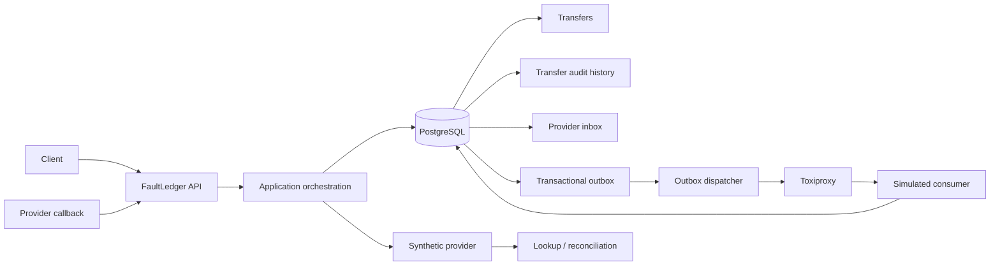

# FaultLedger topology

The consumer is a laboratory fixture, not another FaultLedger business system.
Toxiproxy sits only on the outbound HTTP path. No broker, Redis, global
ordering service, or real financial network is part of this topology.
