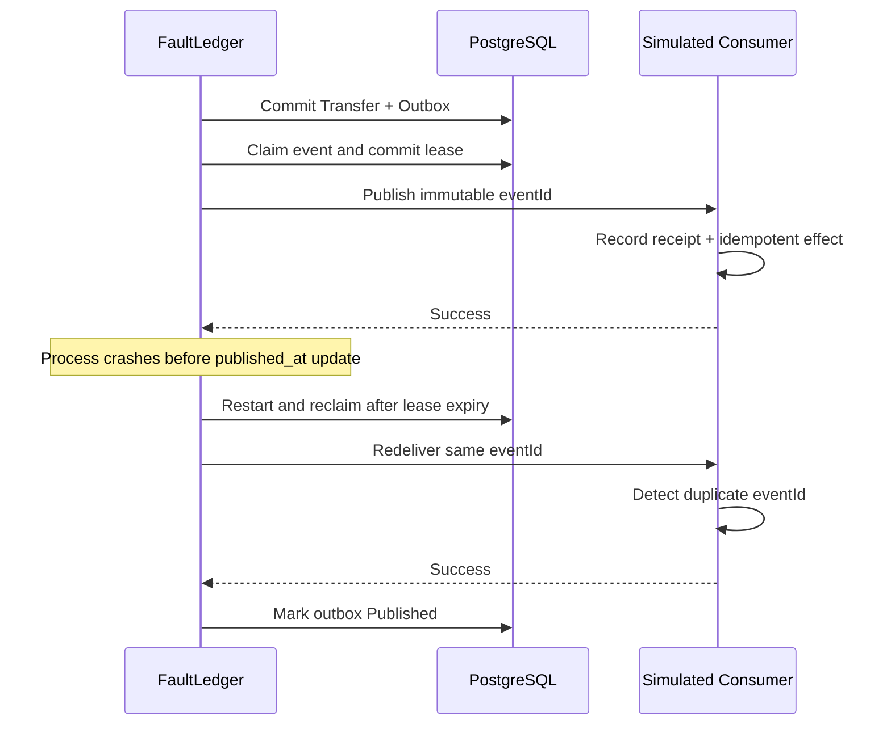

# Transactional outbox and at-least-once delivery

FaultLedger treats outbound integration-event publication as **at-least-once**.
PostgreSQL is authoritative for both the Transfer and its outbox row. When a
Transfer enters `Completed`, the persistence transaction inserts one versioned
`TransferCompleted` message with the state change. The named
`uq_outbox_aggregate_event` constraint makes the logical completion event
unique per Transfer; it is a database invariant, not an in-memory set.

The dispatcher claims one due row in a short PostgreSQL transaction using
`FOR UPDATE SKIP LOCKED`, records a claim token and lease, commits, and only
then performs HTTP delivery. It never holds a database lock across network
I/O. A successful delivery is acknowledged with a conditional update that
requires the same claim token. A worker whose lease expired cannot mark a
newer worker's claim as published.

Publication and the local `published_at` update cannot be one distributed
transaction. If the consumer commits and the publisher crashes before the
local acknowledgement, the same immutable event ID is delivered again. The
simulated consumer records every receipt but applies one logical effect per
event ID in PostgreSQL. This is safe redelivery, not exactly-once distributed
delivery.

Failures are scheduled with a deterministic five-second retry delay supplied
by `TimeProvider`; tests advance controlled time instead of sleeping. A
permanently failing message is deferred by `next_attempt_at`, so later due
messages can still proceed. Expired claims are recoverable. A lease expiry
does not prove that a remote call did not happen, so consumers must remain
idempotent.

Callback and reconciliation completion use the same invariant. Callback
processing commits the Transfer mutation, `provider_inbox` terminal marker,
and `TransferCompleted` outbox row together. Reconciliation commits the
Transfer and outbox row together. A rollback leaves all participating records
unchanged.

The dispatcher does not guarantee global ordering. Toxiproxy is used only for
real network-path failure demonstrations; semantic provider failures remain
in the deterministic MockProvider laboratory. No transactional outbox
dispatcher emits financial submissions, and no Stage 6 component retries a
provider operation.

For the Docker laboratory, the simulated consumer's small deduplication table
is created by the checked-in Stage 6 migration in the same PostgreSQL instance.
It is fixture infrastructure, not FaultLedger business state or a second
source of truth.
