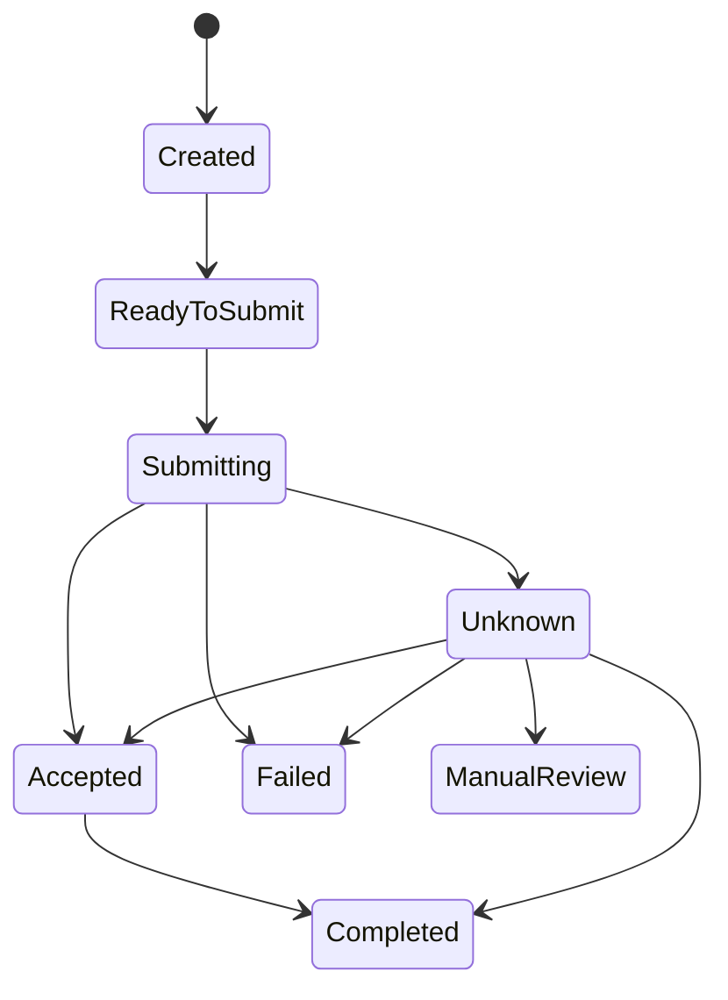

# Transfer domain and durability boundary

Authority: [AGENTS.md](../../AGENTS.md). Decision:
[ADR 0002](../adr/0002-transfer-domain-and-persistence.md). Actual evidence:
[Stage 1 validation](../runbooks/stage1-validation.md).

## Money and identity

Money is an immutable, currency-bearing decimal value. It permits zero and
negative amounts; Transfer creation requires a strictly positive amount.
Magnitude is at most 99999999999999999999.99999999, with at most 8 encoded
fractional decimal places. More than 8 places, including redundant trailing
zeros, are rejected. No two-decimal currency assumption is made.

Currency is exactly three ASCII letters, uppercased invariantly. ZZZ is valid
shape, not proof of an active ISO currency. Equality compares decimal value
and canonical currency, not textual scale. Small same-currency addition and
subtraction are exact and checked; mismatches and out-of-range results fail.
There is no exchange-rate or general financial math library.

The JSON boundary validates raw fixed-point digits before decimal conversion,
so a long JSON mantissa cannot round into a seemingly valid Money. Scientific
notation and quoted numeric strings are deliberately unsupported. PostgreSQL
`numeric(28,8)` preserves supported values but may pad their stored scale to 8;
original textual scale is not retained. Direct administrative SQL can coerce
excess scale before constraints run and is not a supported application write path.

Transfer uses a validated nonempty UUID, not database-generated identity.
Application creates UUIDs; deterministic tests use fixed identities where
needed. Client references (1-100) and keys (1-128) permit ASCII alphanumerics and
`-`, `_`, `.`, `:` without trimming or case normalization. No wrapper type is
needed just to rename a Guid/string. Keys are globally scoped, case-sensitive,
unique and immutable; client-reference uniqueness has not been defined.

## Aggregate and state machine

The aggregate owns Money, identity, immutable request references, state,
provider reference, created/updated timestamps and transition version. There
are no public mutable setters or generic ChangeState command. Restore is a
validated persistence boundary, not an API state-changing operation.

Completed and Failed are terminal. Accepted is not final completion. Unknown is
an explicit non-final epistemic state: the provider may have accepted the
operation but FaultLedger lacks sufficient evidence to classify it. It exposes
`DoNotRepost` and cannot return to `ReadyToSubmit` or `Submitting`. Only an
explicit provider lookup can authorize the shown Unknown resolution edges;
`NotFound` and `StillUnknown` preserve Unknown. Illegal transitions and replayed
transitions throw explicitly without mutation. No silent terminal regression or
transition retry is provided.

Acceptance requires a nonempty validated provider reference. Failure, uncertainty,
completion and manual-review methods require explicit evidence/reason text. This
stage does not authenticate real provider evidence or persist an audit history;
reason text is validated but not retained. Future audit work must model that
deliberately rather than treating logs as authoritative evidence.

TimeProvider is read in Application, never hidden inside Domain. Supplied domain
timestamps are normalized to UTC and truncated to microseconds. Transitions
reject backward time, permit equal timestamps, and increment Version exactly
once. The timestamp zero/infinity sentinel is rejected. The present graph has
versions 0 (Created), 1 (ReadyToSubmit), 2 (Submitting), 3 (normal
Accepted/Failed/Unknown), 4 (reconciled Accepted/Failed, direct Completed, or
ManualReview), and 5 (Completed after a reconciled Accepted). Changing the graph
requires reviewing the stored version/state constraint, not silently introducing
incompatible state strings.

## Persistence and concurrency

Infrastructure's internal TransferRecord is mapped by FaultLedgerDbContext.
ToTransfer validates Money, canonical currency, state, version, provider reference
and timestamps before yielding a domain object. No EF reference enters Domain
or Application. ITransferStore is a small use-case-specific boundary, not a
generic repository or an extra UnitOfWork.

The transfers table has a UUID primary key, bounded request/reference strings,
versioned SHA-256 request fingerprint, numeric(28,8) amount, uppercase currency,
constrained string state, nullable provider reference, timestamptz timestamps and
bigint version. CHECK constraints protect identity, positive amount, currency,
reference/key/fingerprint shapes, state/version combinations, accepted-reference
consistency and timestamp order. The named `uq_transfers_idempotency_key` unique
index reserves each global idempotency key. Fingerprint, audit, inbox and outbox
are separate concerns; only the fingerprint belongs to Stage 3.

Updates mark only state, provider reference, updated time and version as mutable.
EF's concurrency predicate compares the original version; a losing writer gets
an explicit TransferConcurrencyException. No automatic database retry exists.
The real test loads one transfer into two independent contexts before either
writer saves, then verifies the stale save cannot overwrite the first. That
test is not a claim of 100-request or multi-process idempotency proof.

## Actual submission sequence and failure windows

Transfer updates use an explicit PostgreSQL transaction; completion updates
also insert the outbox message before commit. Application does not open the
database transaction. The MockProvider performs no real network I/O and
records fake external truth in a separate process-local ledger. Its interface
does not move transactions around a provider call.

| Step | Already durable | What can fail next / safe disposition |
| --- | --- | --- |
| Validate request and construct ReadyToSubmit | Nothing for this request | Invalid input returns 400 before persistence/provider work. |
| Register key, fingerprint and ReadyToSubmit | Immutable request identity, key, fingerprint and version 1 after one PostgreSQL commit | A lost commit acknowledgement is not rollback proof. A same-key retry loads the durable winner; a different fingerprint conflicts. |
| Claim submission atomically | Submitting/version 2 after one conditional PostgreSQL update | Exactly one contender can claim `ReadyToSubmit/version 1`; losers do not call the provider. |
| Claim `Submitting` and commit | Submitting/version 2 after the conditional update | This is durable possible-dispatch intent. A crash before the actual call may still require conservative ambiguity. |
| Invoke provider once | Submitting/version 2 | The provider may accept while response/local certainty is lost. No DB transaction is held across the call. |
| Receive synthetic acceptance | Still Submitting/version 2 | In-memory success is not durable Accepted evidence. Cancellation or a crash can lose it. |
| Mark Accepted and save | Accepted/reference/version 3 only after commit | A failed or unacknowledged commit never authorizes a second submission. |
| Return 201 | Accepted if its save completed | A lost HTTP response does not erase the operation. GET reads it; same-key/same-request POST replays with 200, while a changed canonical request returns 409. |

No provider call precedes successful durable Submitting. Unit tests prove call
ordering, failure/cancellation propagation and absence of automatic repost;
they do not prove PostgreSQL. The real HTTP/DB test inspects Submitting from an
independent context at provider entry and checks the request context has no open
transaction. Real migration/round-trip/reload/concurrency evidence remains
blocked wherever Docker is absent.

## Deliberately incomplete guarantees

A process crash after provider acceptance but before local Accepted persistence
cannot yet be classified from a durable `Submitting` row alone. Durable
Submitting must be interpreted as possibly attempted/ambiguous, never as
ordinary failure or permission to send. Stage 4 classifies explicit ambiguous
provider results as Unknown and offers explicit provider lookup reconciliation;
it does not reset a crash-stuck Submitting row. Stage 5 adds the durable
callback inbox. Stage 6 adds an atomic completion outbox and at-least-once
integration-event dispatcher; that dispatcher never calls provider submission.
Stage 2's provider failure simulator and ledger are test/laboratory behavior
only and do not make the local PostgreSQL workflow durable across provider
ambiguity.

Stages 3 and 4 now implement durable same-request replay and safe ambiguous
outcome reconciliation under FL-RULE-006 and FL-RULE-003.
The first committed fingerprint owns the key; a different fingerprint returns a
409 conflict and cannot overwrite the stored request. Never suggest changing
keys after a timeout. Original state/request data are not overwritten on a
duplicate. Explicit ambiguous provider responses are now reconciled in Stage 4;
crash-stuck `Submitting` recovery remains conservative until dispatch evidence
can be established.

Graceful host/context recreation is tested for persistence, not claimed as
abrupt-process-crash recovery. Readiness checks connectivity only, not schema
version. API authentication, restricted DB roles and real operational deployment
are not provided; all data/provider behavior is synthetic and local-only.
