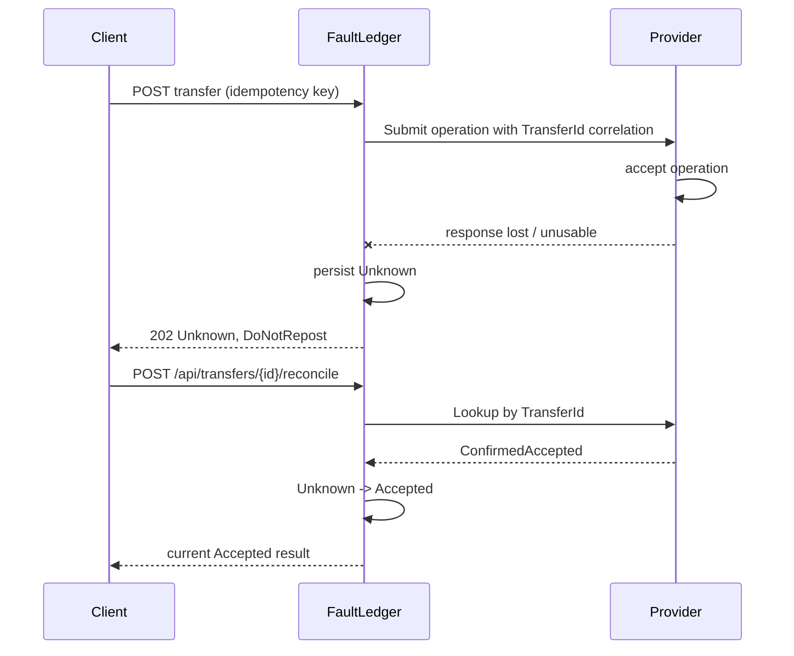

# UNKNOWN outcomes and explicit reconciliation

Authority: [AGENTS.md](../../AGENTS.md), FL-RULE-003 and FL-RULE-011. This
document describes the Stage 4 implementation and its evidence boundary; it is
not a claim of production payment-rail behavior.

## Meaning of UNKNOWN

`Unknown` is an epistemic state. It means FaultLedger cannot prove that the
provider operation was accepted, completed, rejected, or safely absent. A
timeout, connection loss, HTTP 500, malformed response, cancellation, or lost
local acknowledgement after dispatch is therefore not automatically a failure.
The deterministic MockProvider makes the acceptance boundary visible so tests
can prove this mapping.

Ambiguous submission evidence is persisted as:

```text
Submitting -> Unknown
```

`Unknown` is non-final and exposes `RetryAdvice=DoNotRepost`. An idempotent
replay returns the same durable transfer and does not invoke `SubmitAsync`.
`Unknown` can never transition to `ReadyToSubmit` or `Submitting`.

## Stable correlation and lookup boundary

The transfer UUID is sent in `ProviderTransferRequest` before the provider
response exists. It is also persisted in PostgreSQL, so a lost provider
reference does not make lookup impossible after restart. Reconciliation uses a
separate `ITransferLookup.LookupAsync` boundary; it cannot submit a financial
operation. The fake provider's `LookupAttempts` counter is separate from
`SubmissionAttempts`.

Lookup evidence is explicit:

| Provider lookup evidence | Local behavior |
| --- | --- |
| `ConfirmedAccepted` | `Unknown -> Accepted` |
| `ConfirmedCompleted` | `Unknown -> Completed` |
| `ConfirmedRejected` | `Unknown -> Failed` |
| `NotFound` | preserve `Unknown`; never repost |
| `StillUnknown` | preserve `Unknown`; never repost |
| `TemporaryFailure` / lookup transport failure | preserve `Unknown`, report reconciliation unavailable |

`NotFound` is deliberately not interpreted as proof of non-acceptance. Provider
eventual consistency or an unavailable lookup index can hide an accepted
operation. A later explicit reconciliation can resolve the same transfer.

## Ambiguous submit and reconciliation



The reconcile endpoint performs one explicit lookup and only an
evidence-authorized state transition. It does not start a worker, open a
background retry loop, or call `SubmitAsync`.

## NotFound is not repost permission

```text
Unknown
  -> lookup NotFound
  -> Unknown remains
  -> DoNotRepost remains
  -> no provider submission
```

The deterministic fake can model eventual visibility as
`NotFound -> ConfirmedAccepted`; both lookups leave `SubmissionAttempts` at the
original value of one. Reconciliation after a fresh application host uses the
durable transfer UUID, not process memory.

## Concurrency and limitations

Concurrent reconciliation uses PostgreSQL optimistic version checks. If two
lookups both obtain accepted evidence, one state update wins and the loser
reloads durable state. Neither path submits. Lookup calls may be repeated; that
is safe because lookup is side-effect-free with respect to provider submission.

A transfer left in durable `Submitting` after a crash before FaultLedger has
classified the provider result remains conservative and is not automatically
recovered by this stage. No elapsed-time reset, automatic repost, scheduler,
Redis lock, or Polly retry is implemented. Provider callbacks and their durable
inbox are implemented in Stage 5; completion now creates the Stage 6 outbox
event atomically, and its dispatcher never submits a provider operation.
