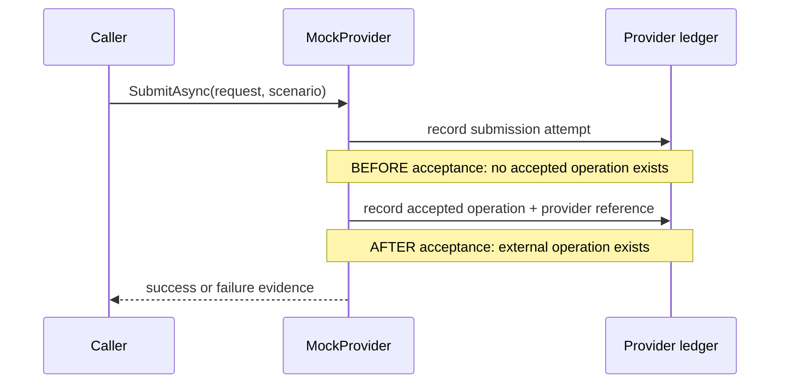
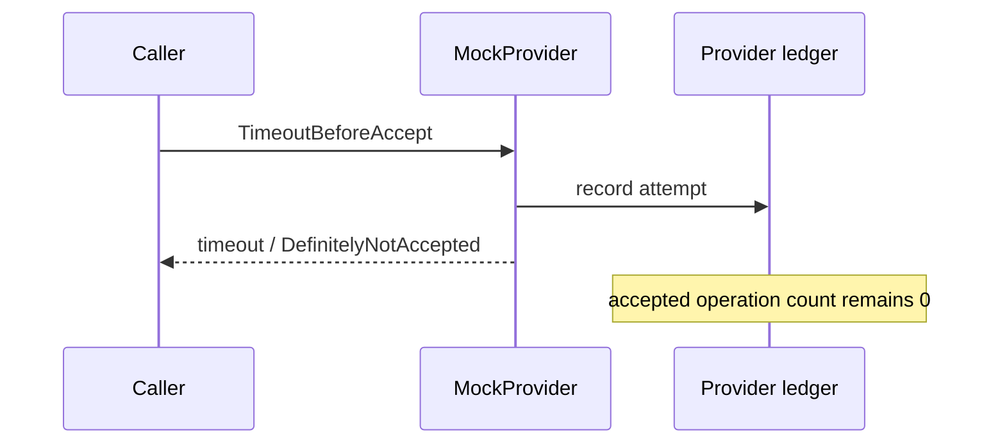
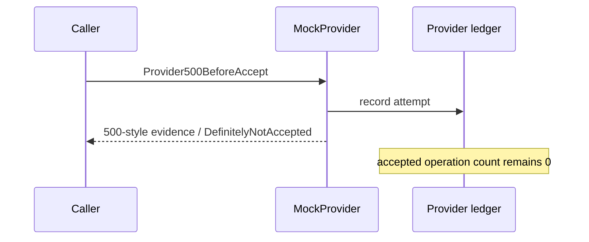
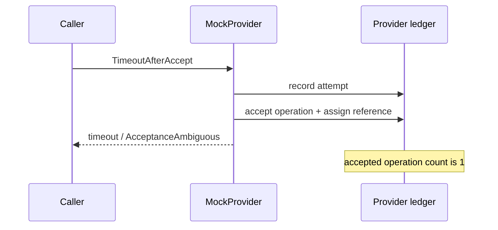
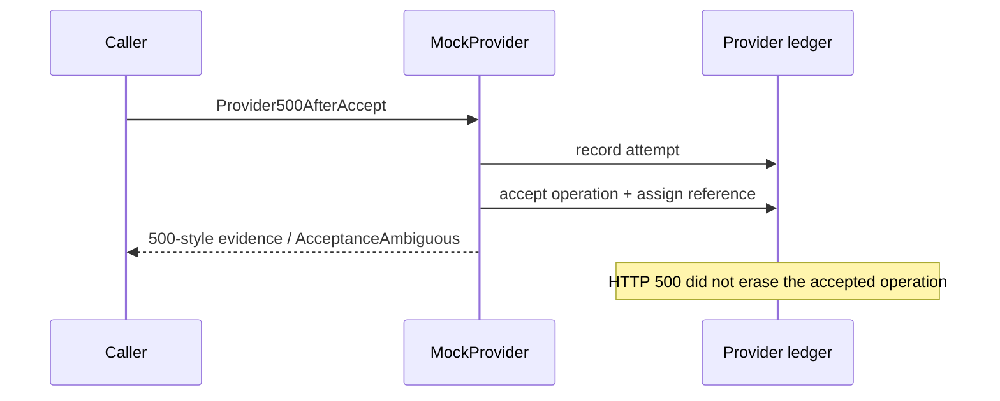

# Deterministic MockProvider failure laboratory

FaultLedger's `SyntheticTransferProvider` has an explicit, deterministic
scenario boundary. Tests construct the provider with one
`MockProviderScenario`; the production composition root always selects
`Success`. There is no random selector and no HTTP header that can change
production behavior. Unknown enum values fail closed.

The `MockProviderLedger` is a deliberately process-local model of the fake
external provider. It is test/laboratory truth only: PostgreSQL remains the
FaultLedger authority for local transfers, idempotency, and durable state. The
ledger records submission attempts separately from accepted operations.

## Scenario matrix

| Scenario | Request reaches provider? | Provider accepts? | Provider ledger changed? | Caller sees | Certainty |
| --- | ---: | ---: | ---: | --- | --- |
| `Success` | yes | yes | yes | success result | confirmed accepted |
| `Rejected` | yes | no | no accepted operation | rejection result | confirmed rejected |
| `TimeoutBeforeAccept` | attempted | no | no | timeout result | definitely not accepted |
| `TimeoutAfterAccept` | yes | yes | yes | timeout result | acceptance ambiguous |
| `ConnectionFailureBeforeAccept` | no | no | no | connection error result | definitely not accepted |
| `ConnectionLostAfterAccept` | yes | yes | yes | connection loss result | acceptance ambiguous |
| `Provider500BeforeAccept` | yes | no | no | server error result | definitely not accepted in this laboratory |
| `Provider500AfterAccept` | yes | yes | yes | server error result | acceptance ambiguous |
| `MalformedResponseAfterAccept` | yes | yes | yes | unusable-response result | acceptance ambiguous |
| `SlowResponse` | yes | controlled | controlled | delayed success result | controlled by gate |

The HTTP status or transport symptom does not establish this certainty in a
real provider. The before/after distinction is known here only because the
scenario explicitly controls the simulated acceptance boundary.

For after-accept failures, the provider ledger contains a stable synthetic
reference even though the caller-visible result does not expose a usable
success reference. That models a lost or unusable response rather than a
confirmed rejection.

## Acceptance boundary

The provider records an attempt first. For accepting scenarios it then crosses
one visible boundary and records the provider operation. The result is created
after that point:

## Before-accept timelines

## After-accept timelines

## Evidence and tests

`MockProviderFailureLaboratoryTests.ExplicitScenario_RecordsAttemptAndSeparatesAcceptanceTruth`
covers every named scenario except the gate-specific checks. The test asserts
attempt count, accepted-operation count, provider reference visibility,
provider-side lookup, failure kind, acceptance evidence, and request reachability.

`TimeoutAfterProviderAcceptance_ProviderOperationExistsDespiteCallerFailure`
is the focused regression for the most important ambiguity window.
`SlowResponse_UsesControlledGateBeforeAcceptanceAndCompletesAfterRelease`
proves that no wall-clock delay is used. The concurrent stress test releases
64 calls only after all 64 have reached the controlled gate and verifies unique
references and ordered attempt history. These tests protect the fake provider's
thread safety; they do not prove FaultLedger's durable idempotency.

Application orchestration converts any non-confirmed result into a typed
`ProviderSubmissionException` and leaves the existing durable `Submitting`
state unchanged. It intentionally does not map ambiguity to `Unknown`, add
reconciliation, or retry a submission in this stage.
